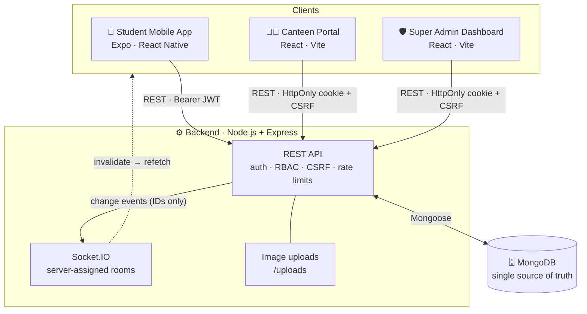
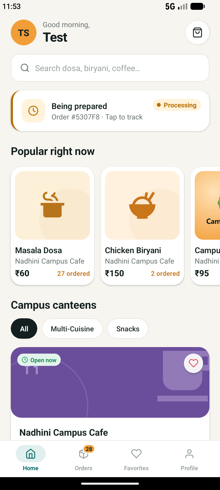
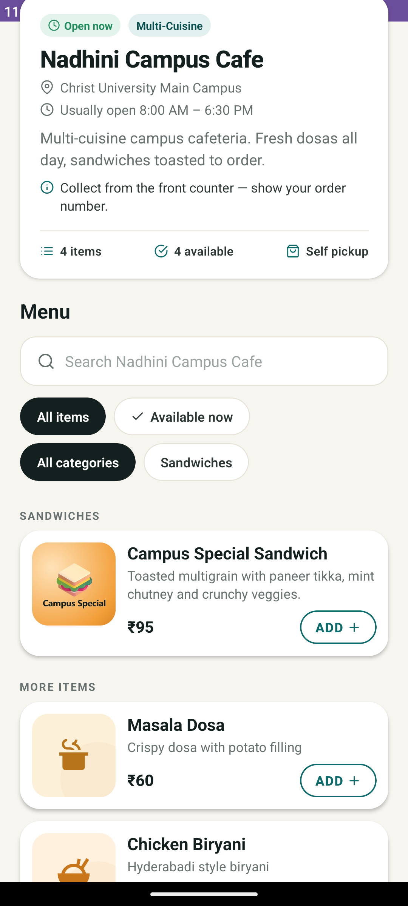
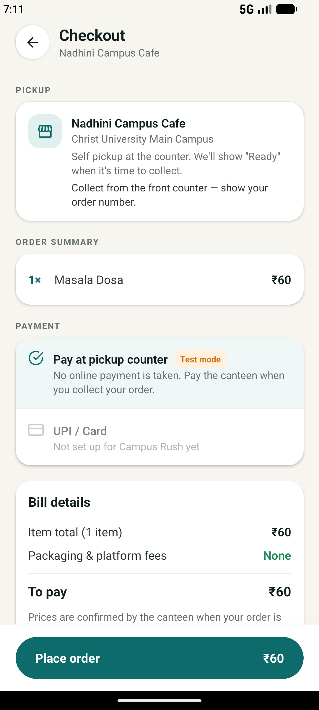
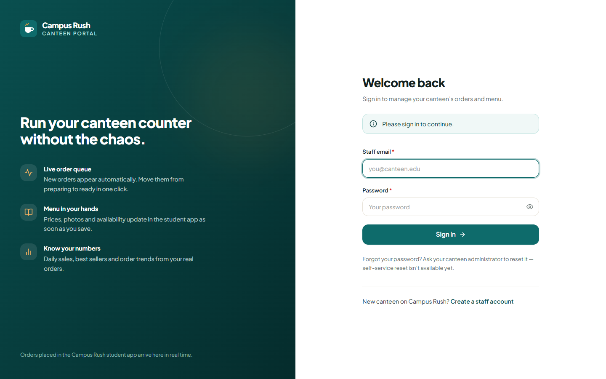
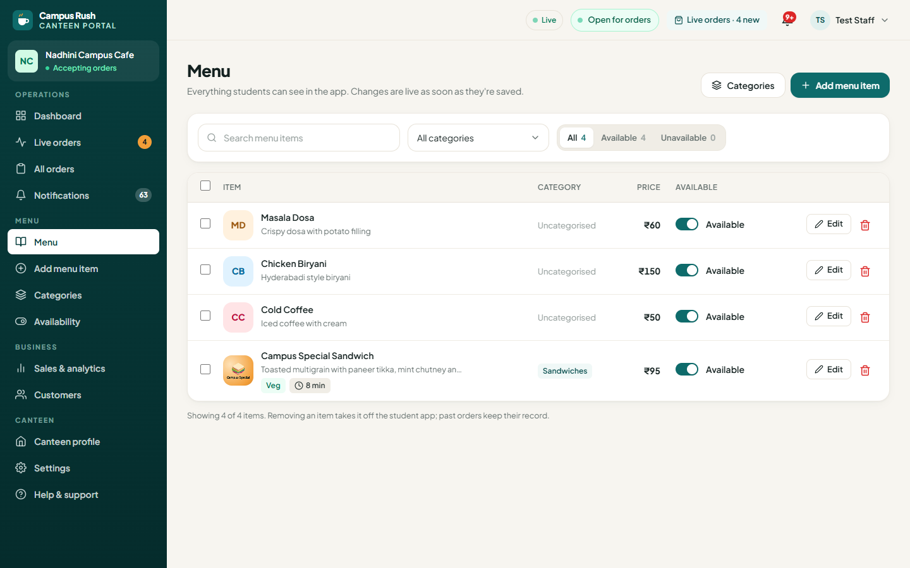
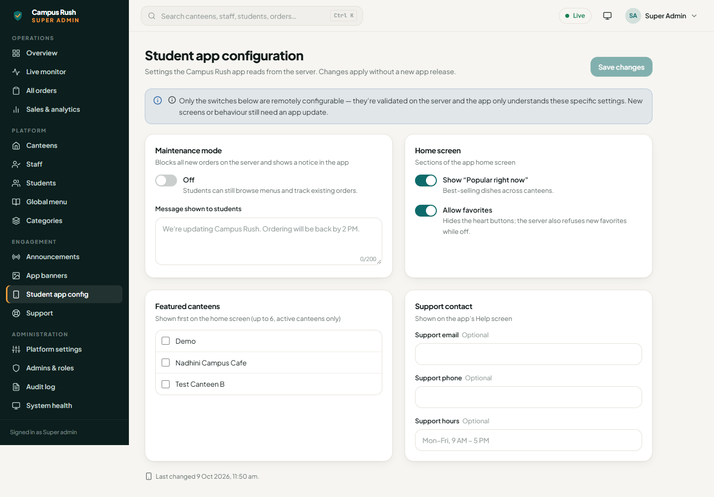

<div align="center">

# 🍽️ Campus Rush

**A full-stack campus food-ordering platform: a student mobile app, a canteen management portal and a super admin dashboard, kept in sync in real time by one backend.**


[Overview](#overview) · [Features](#key-features) · [Architecture](#architecture) · [Tech stack](#tech-stack) · [Screenshots](#screenshots) · [Getting started](#getting-started-windows) · [Testing](#testing-and-builds) · [Roadmap](#future-improvements)

</div>

---

## Overview

Campus Rush replaces the lunch-hour queue at campus canteens. Students browse menus and place pickup orders from their phone. Canteen staff run the counter from a live order board, and platform administrators oversee every canteen, account and order from one dashboard.

All three interfaces share **one Express API and one MongoDB database**. The database is the single source of truth. Socket.IO pushes small "something changed" events, and each client refetches from the API. A price change, a new order, or a suspended account shows up across the platforms within seconds, without a page reload.

| Interface | Who uses it | Built with |
| --- | --- | --- |
| 📱 **Student Mobile App** | Students | Expo SDK 49 · React Native 0.72 · Redux Toolkit |
| 🧑‍🍳 **Canteen Management Portal** | Canteen managers and staff | React 18 · Vite 5 · Tailwind CSS |
| 🛡️ **Super Admin Dashboard** | Platform administrators | React 18 · Vite 5 · Tailwind CSS · Chart.js |
| ⚙️ **Backend API** | All three clients | Node.js · Express 4 · Mongoose 8 · Socket.IO 4 |

> **Status:** source code only. This repository is public, but the application isn't deployed to a public environment. Run it locally with the steps below.

---

## Key features

### 📱 Student Mobile App
- Email sign-up and sign-in, with a profile editor and password change.
- Home screen with admin-managed banners and announcements, featured canteens, "Popular right now" dishes, and canteen filters by cuisine.
- Search across canteens and dishes, canteen pages with category filters, and food details.
- Single-canteen cart and checkout with **pay at the pickup counter**.
- Live order tracking (Placed → Processing → Ready → Completed), active and past order history, and favorites.
- Help and support requests, plus live notices for maintenance mode, closed or suspended canteens, and suspended accounts.
- A "Reconnecting" indicator when the live connection drops. The app resyncs automatically when it returns to the foreground.

### 🧑‍🍳 Canteen Management Portal
- Dashboard with today's orders, revenue, average order value, a 7-day chart, best sellers and quick actions.
- **Live kitchen board** (New → Preparing → Ready → Collected), with recording of counter payments.
- Order history with filters and order detail pages.
- Menu management: create and edit items with photo upload, categories, and one-click availability toggles.
- Sales analytics, a customers view, notifications, and platform announcements.
- Canteen profile, open/closed control, settings, and help with support tickets.
- **Manager and staff roles.** Staff can update availability and run orders; only managers can edit the menu, categories or profile.
- Staff join through a one-time password-setup link created by an admin. A new canteen can also self-register, and it stays hidden until an admin approves it (configurable).

### 🛡️ Super Admin Dashboard
- Platform overview with KPIs, sales trends, popular items, top canteens and recent activity; a live order monitor; and an all-orders view with admin status overrides (a reason is required).
- Sales analytics with date-range filters.
- **Canteen lifecycle:** create, edit, approve, suspend and reactivate (a reason is required), with a detail view per canteen.
- Staff management with invites, roles and suspension; student management with order history and suspension.
- A global menu across all canteens, and per-canteen categories.
- Student-app content: announcements, home banners (in-app destinations only), and remote app configuration such as maintenance mode, home sections, featured canteens and support contact.
- Support ticket inbox, platform settings (order limits, onboarding rules), and admin accounts with **role-based permissions** (`super_admin`, `operations`).
- An **append-only audit log** of every admin action, plus a system health page covering the API, database and realtime connections.
- Global search (Ctrl + K), dark mode, and responsive layouts.

### ⚙️ Backend and platform
- REST API for students, staff and admins, grouped into separate routers. Mongoose models cover canteens, menu items, orders, students, staff, admins, announcements, banners, settings, support tickets, activity and the audit log.
- **Realtime sync:** the server assigns Socket.IO rooms from the authenticated identity (per user, per canteen, admins). Events carry IDs only, and clients refetch from the API.
- **Server-enforced business rules:**
  - Order status transitions follow a fixed path, and invalid jumps are rejected for staff and admins alike.
  - Prices and line items are snapshotted into each order, so later menu changes don't alter history.
  - Maintenance mode, order limits and canteen status are enforced at checkout.
- **Security:**
  - Web sessions use HttpOnly cookies with double-submit CSRF tokens; the mobile app uses Bearer JWTs.
  - Suspending a staff or admin account, or changing its password, ends its existing sessions. Suspended students keep read-only access but can't place orders.
  - Failed logins are rate-limited, uploaded images are validated by their file signature, and there is no public admin registration.
- Idempotent database migration and a one-time **super admin bootstrap** script.

---

## Architecture



**What happens when an order is placed:** the student app calls the API, and the order is validated and saved in MongoDB. The server emits `order.created` to that canteen's room and to the admins. The canteen's live board and the admin monitor refetch and show it. Status changes flow back to the student the same way.

More detail on the security model, realtime rooms and admin roles is in [`orderOnCampus-full/docs/SUPER_ADMIN.md`](orderOnCampus-full/docs/SUPER_ADMIN.md).

---

## Tech stack

| Layer | Technologies |
| --- | --- |
| **Student app** | Expo SDK 49, React Native 0.72, React Navigation 6 (native stack + bottom tabs), Redux Toolkit, Axios, Socket.IO client, AsyncStorage |
| **Canteen portal** | React 18, Vite 5, React Router 6, Tailwind CSS 3, Chart.js (react-chartjs-2), Axios, Socket.IO client |
| **Super admin** | React 18, Vite 5, React Router 6, Tailwind CSS 3, Chart.js (react-chartjs-2), React Icons, Axios, Socket.IO client |
| **Backend** | Node.js, Express 4, Mongoose 8 (MongoDB), Socket.IO 4, jsonwebtoken, bcryptjs, cookie-parser, CORS, dotenv |
| **Testing** | Node's built-in test runner (API and realtime integration tests), Playwright-core browser tests in real Chrome, ESLint |

---

## Screenshots

> Captured from a local development build with test data.

<table>
  <tr>
    <th>Student app: home</th>
    <th>Student app: canteen menu</th>
    <th>Student app: checkout</th>
  </tr>
  <tr>
    <td></td>
    <td></td>
    <td></td>
  </tr>
</table>

| Canteen portal: sign in | Canteen portal: menu management |
| --- | --- |
|  |  |

| Super admin: student app configuration |
| --- |
|  |

---

## Project structure

```
Campus Rush/
├── README.md
└── orderOnCampus-full/
    ├── server/                      # Backend API (Express + Socket.IO + MongoDB)
    │   ├── app.js                   #   Entry point (npm start)
    │   ├── routes/                  #   admin.js (/admin/*), routes.js (staff & public), users.js (students)
    │   ├── controllers/             #   Request handlers (controllers/admin/ = Super Admin APIs)
    │   ├── model/                   #   Mongoose models
    │   ├── middleware/auth.js       #   Sessions, roles, CSRF, audit logging
    │   ├── lib/                     #   Realtime, rate limiting, order rules
    │   ├── scripts/                 #   migrate.js, bootstrap-admin.js
    │   ├── tests/                   #   API + realtime integration tests
    │   └── .env.example             #   Environment template
    ├── client/
    │   ├── orderOnCampus-app/       # 📱 Student mobile app (Expo)
    │   ├── orderOnCampus-canteen/   # 🧑‍🍳 Canteen management portal (Vite)
    │   └── orderOnCampus-admin/     # 🛡️ Super admin dashboard (Vite)
    ├── e2e/                         # Real-browser tests for both web portals
    └── docs/                        # Architecture notes and screenshots
```

---

## Getting started (Windows)

### Prerequisites
- **Node.js** with npm. This project was developed and tested on Node.js 24.
- A **MongoDB** connection string, either a local MongoDB or a MongoDB Atlas cluster.
- **Android Studio** with an Android emulator, plus the **Expo Go** app on that emulator, to run the student app.
- **Google Chrome**, only for the browser tests.

### 1. Configure the backend

```powershell
cd "orderOnCampus-full\server"
Copy-Item .env.example .env      # then edit .env with your own values
npm install
```

| Variable | Required | Purpose |
| --- | --- | --- |
| `MONGODB_URI` | ✅ | MongoDB connection string |
| `JWT_SECRET` | ✅ | Long random string used to sign session tokens |
| `PORT` | | API port (default `5001`) |
| `ALLOWED_ORIGINS` | | Comma-separated web origins allowed by CORS (defaults to the local portal ports 5173, 5174 and 3000) |
| `CANTEEN_APP_URL` / `ADMIN_APP_URL` | | Base URLs used in staff and admin setup links (defaults `http://localhost:5173` / `http://localhost:5174`) |
| `STAFF_SIGNUP_CODE` | | Optional invite code required for canteen self sign-up |
| `ADMIN_BOOTSTRAP_EMAIL` / `ADMIN_BOOTSTRAP_PASSWORD` | | First super admin login (written for you by the bootstrap script) |
| `OPENAI_API_KEY`, `STRIPE_SECRET_KEY` | | Not needed. Reserved for planned features (see [Future improvements](#future-improvements)) |

Use placeholders in `.env.example` only. Never commit your `.env`; it's already in `.gitignore`.

### 2. Prepare the database and create the first admin

```powershell
npm run migrate -- --dry                 # preview changes
npm run migrate                          # safe to re-run
npm run bootstrap:admin -- --write-env   # creates the first super admin once
```

The bootstrap script writes `ADMIN_BOOTSTRAP_EMAIL` and a generated `ADMIN_BOOTSTRAP_PASSWORD` into your local `.env`. It never prints the password, refuses to run in production, and does nothing if an admin already exists. There is no public admin registration; other admins are invited from **Admins & roles**.

### 3. Run everything

Use one terminal per app, from the repository root:

```powershell
# Backend API → http://localhost:5001
cd "orderOnCampus-full\server";                 npm start

# Super Admin Dashboard → http://localhost:5174
cd "orderOnCampus-full\client\orderOnCampus-admin";   npm install; npm run dev

# Canteen Management Portal → http://localhost:5173
cd "orderOnCampus-full\client\orderOnCampus-canteen"; npm install; npm run dev

# Student Mobile App (start the Android emulator first, then press "a")
cd "orderOnCampus-full\client\orderOnCampus-app";     npm install; npx expo start --port 8082
```

The web portals read `VITE_API_URL` (default `http://localhost:5001`). The app reads `EXPO_PUBLIC_API_URL`; without it, the Android emulator uses `http://10.0.2.2:5001` to reach the backend on your machine.

---

## Testing and builds

```powershell
# Lint and production builds (each web portal)
cd "orderOnCampus-full\client\orderOnCampus-admin";   npm run lint; npm run build
cd "orderOnCampus-full\client\orderOnCampus-canteen"; npm run lint; npm run build

# Backend API + realtime integration tests (41 tests; the backend must be running)
cd "orderOnCampus-full\server"; npm test

# Real-browser tests in Chrome (backend and both portals must be running)
cd "orderOnCampus-full\e2e"; npm install
npm run admin      # Super Admin workflow test (59 checks)
npm run canteen    # Canteen portal workflow test (40 checks)
```

- **API tests** run against your local backend and database. They need the bootstrap admin and existing test accounts set in `server/.env`: `TEST_STAFF_EMAIL`/`TEST_STAFF_PASSWORD`, `TEST_STAFF2_EMAIL`/`TEST_STAFF2_PASSWORD` and `TEST_STUDENT_EMAIL`/`TEST_STUDENT_PASSWORD`. The tests create clearly labelled `[TEST]` records and suspend or deactivate them afterwards; they never delete orders.
- **Browser tests** read the same `server/.env` (the admin login, and for the canteen test the `TEST_STAFF_*` accounts). They use your installed Chrome. Set `CHROME_PATH` if it isn't in the default location. `HEADED=1` shows the browser, and `SHOTS_DIR` changes where screenshots are saved.
- The login rate limiter is deliberately strict. If you run the API suite many times in a row, restart the backend to reset it.

---

## Future improvements

These are **not implemented yet**:

- **Online payments.** Checkout currently supports pay-at-counter only, and staff record payments manually. Stripe and UPI packages are in the project, but no online payment flow is wired into the app.
- **AI ordering assistant.** A guarded `/ai` endpoint exists on the backend, but no client screen uses it.
- **Push notifications.** Live updates currently reach the app only while it's open.
- **Production deployment.** This includes a shared rate-limit store such as Redis for multiple server instances, and cleanup of unused uploaded images.
- Self-service password reset for staff and students.
- Platform-wide menu categories. Categories are per canteen today.

---

<div align="center">

Built with React Native, React and Node.js · Original project base: [`orderOnCampus-full/README.md`](orderOnCampus-full/README.md)

</div>
